# 🚀 MERN Stack - Cloud Native Deployment Guide

## 📋 Tổng Quan Dự Án

### Kiến Trúc Hệ Thống

```
┌─────────────────────────────────────────────────────────────┐
│                    PRODUCTION ARCHITECTURE                   │
├─────────────────────────────────────────────────────────────┤
│                                                               │
│  ┌──────────────┐      ┌──────────────┐    ┌─────────────┐ │
│  │   Client     │──────▶│   Backend    │────▶│  MongoDB    │ │
│  │  (Render)    │      │  (Render)    │    │   Atlas     │ │
│  │  React+Vite  │      │  Node+Express│    │   Cloud     │ │
│  └──────────────┘      └──────────────┘    └─────────────┘ │
│        │                      │                              │
│        │                      ▼                              │
│        │              ┌──────────────┐                       │
│        └──────────────▶│  Redis Cache │                      │
│                        │  (Optional)  │                      │
│                        └──────────────┘                      │
└─────────────────────────────────────────────────────────────┘
```

## 🔧 Stack Công Nghệ

### Frontend

- **Framework:** React 19.1.0
- **Build Tool:** Vite 6.3.5
- **UI Library:** Ant Design 5.25.4
- **State Management:** Context API
- **Routing:** React Router DOM 7.6.2
- **Web Server:** Nginx (Alpine)

### Backend

- **Runtime:** Node.js 20
- **Framework:** Express 5.1.0
- **Database:** MongoDB 8.15.1 (Atlas)
- **Authentication:** JWT (jsonwebtoken 9.0.2)
- **Password Hash:** Bcrypt 6.0.0

### DevOps & Cloud

- **Container:** Docker (Multi-stage builds)
- **CI/CD:** GitHub Actions
- **Deployment:** Render.com
- **Image Registry:** Docker Hub
- **Monitoring:** Health checks + Logging middleware
- **Database:** MongoDB Atlas (Managed)

## 📊 Database Information

### MongoDB Atlas Cloud Database

```bash
# Connection Details
Provider: MongoDB Atlas
Region: Auto-selected (closest to application)
Database Name: cloud_project
Type: Cluster (Shared/Dedicated based on plan)

# Collections:
- users (authentication)
- brandLanguages
- categoryLanguages
- languages
- blogLanguages
```

### Why MongoDB Atlas?

✅ **Fully Managed** - No server maintenance needed  
✅ **Auto-Scaling** - Scales with your application  
✅ **Built-in Backup** - Automated daily backups  
✅ **High Availability** - 99.995% uptime SLA  
✅ **Global Distribution** - Deploy close to users  
✅ **Security** - Encryption at rest and in transit

## 🎯 CI/CD Pipeline Flow

### Advanced Pipeline Stages

```mermaid
graph LR
    A[Git Push] --> B[Code Quality Check]
    B --> C[Security Audit]
    C --> D[Build Docker Images]
    D --> E[Push to Docker Hub]
    E --> F[Deploy to Render]
    F --> G[Health Check]
    G --> H[Success ✅]
```



### Pipeline Features

1. **Quality Gate**

   - ESLint checking
   - npm audit for vulnerabilities
   - Build validation

2. **Docker Optimization**

   - Multi-stage builds
   - Layer caching
   - Minimal image size

3. **Auto Deployment**

   - Deploy backend first
   - Wait for health check
   - Deploy frontend
   - Final verification

4. **Monitoring**
   - Health endpoints
   - Request logging
   - Error tracking
   - Metrics collection

## 🚀 Deployment Methods

### Method 1: Automatic Deploy (Recommended)

**Prerequisites:**

1. GitHub account with repository
2. Docker Hub account
3. Render account
4. MongoDB Atlas account

**Setup Steps:**

#### 1. Fork/Clone Repository

```bash
git clone <your-repo>
cd cicd
```

#### 2. Configure GitHub Secrets

Go to: `Settings > Secrets and variables > Actions`

Add these secrets:

```
DOCKER_USERNAME=your_dockerhub_username
DOCKER_PASSWORD=your_dockerhub_token
RENDER_API_KEY=your_render_api_key
RENDER_SERVICE_ID_BACKEND=backend_service_id
RENDER_SERVICE_ID_FRONTEND=frontend_service_id
BACKEND_URL=https://your-backend.onrender.com
FRONTEND_URL=https://your-frontend.onrender.com
```

#### 3. Setup Render Services

**Backend Service:**

```yaml
Name: mern-backend
Runtime: Docker
Region: Singapore
Branch: master
Dockerfile Path: ./server/Dockerfile
Health Check Path: /api/health
Environment Variables:
  - NODE_ENV=production
  - MONGO_URL=<your-atlas-connection-string>
  - JWT_SECRET=<generate-random-string>
  - CHATBOT_API_KEY=<your-api-key>
```

**Frontend Service:**

```yaml
Name: mern-frontend
Runtime: Docker
Region: Singapore
Branch: master
Dockerfile Path: ./client/Dockerfile
Environment Variables:
  - VITE_API=https://your-backend.onrender.com
```

#### 4. Push to Trigger Deployment

```bash
git add .
git commit -m "Deploy to production"
git push origin master
```

The CI/CD pipeline will automatically:
✅ Run quality checks  
✅ Build Docker images  
✅ Push to Docker Hub  
✅ Deploy to Render  
✅ Run health checks

### Method 2: Manual Docker Deploy

```bash
# Build images locally
docker build -t your-username/mern-backend:latest ./server
docker build -t your-username/mern-frontend:latest ./client

# Push to Docker Hub
docker push your-username/mern-backend:latest
docker push your-username/mern-frontend:latest

# Deploy using docker-compose
docker-compose -f docker-compose.prod.yml up -d
```

### Method 3: Render Blueprint Deploy

1. Create `render.yaml` in root (already provided)
2. Connect repository to Render
3. Render auto-detects and deploys all services

## 🏥 Health Monitoring

### Health Check Endpoints

```bash
# Basic health check
GET /api/health
Response: { status: "UP", uptime: 12345, ... }

# Readiness check (K8s ready)
GET /api/health/ready
Response: { status: "READY", checks: {...} }

# Liveness check (K8s alive)
GET /api/health/live
Response: { status: "ALIVE", uptime: 12345 }

# Detailed metrics
GET /api/health/metrics
Response: { memory: {...}, cpu: {...}, database: {...} }
```

### Testing Health Checks

```bash
# Test backend health
curl https://your-backend.onrender.com/api/health

# Test frontend
curl https://your-frontend.onrender.com

# Monitor in production
watch -n 5 curl -s https://your-backend.onrender.com/api/health
```

## 🔒 Security Features

### Implemented Security Measures

1. **Rate Limiting**

   - 100 requests/15min for general API
   - 20 requests/15min for auth endpoints
   - IP-based tracking

2. **CORS Configuration**

   - Production: Whitelist specific origins
   - Development: Allow all (for testing)

3. **Security Headers**

   - X-Content-Type-Options
   - X-Frame-Options
   - X-XSS-Protection

4. **Database Security**

   - MongoDB Atlas encryption
   - Connection string in environment variables
   - JWT token authentication

5. **Container Security**
   - Non-root user in containers
   - Minimal base images (Alpine)
   - No secrets in images

## 📈 Performance Optimization

### Current Optimizations

1. **Docker Multi-stage Builds**

   ```dockerfile
   # Build stage - Install all dependencies
   # Production stage - Copy only necessary files
   Result: Smaller images, faster deploys
   ```

2. **Resource Limits**

   ```yaml
   Backend: 512MB RAM, 1 CPU
   Frontend: 256MB RAM, 0.5 CPU
   ```

3. **Health Checks**

   - Prevents routing to unhealthy containers
   - Auto-restart failed services

4. **Logging**
   - Structured JSON logging
   - Rotation: 10MB max, 3 files
   - Ready for centralized logging

### Future Optimizations (Optional)

1. **Redis Caching**

   ```javascript
   // Cache frequently accessed data
   // Reduce database load
   // Faster response times
   ```

2. **CDN Integration**

   - Cloudflare for static assets
   - Image optimization
   - Global distribution

3. **Database Indexing**
   ```javascript
   // Add indexes to frequently queried fields
   db.users.createIndex({ email: 1 });
   ```

## 🎓 Presentation Tips

### Demo Flow

1. **Show Architecture Diagram**

   - Explain each component
   - Highlight cloud-native features

2. **Walk Through CI/CD Pipeline**

   - Show GitHub Actions workflow
   - Demonstrate auto-deploy on push
   - Show Docker Hub images

3. **Live Deployment Demo**

   ```bash
   # Make a small change
   echo "// Updated" >> client/src/App.jsx

   # Push and watch it deploy
   git add .
   git commit -m "Demo update"
   git push

   # Show GitHub Actions running
   # Show Render deployment
   # Show live site update
   ```

4. **Health Monitoring**

   - Show health endpoints
   - Demonstrate logging
   - Show resource usage on Render

5. **Database Showcase**
   - Show MongoDB Atlas dashboard
   - Explain managed database benefits
   - Show connection monitoring

### Key Points to Emphasize

✅ **Cloud-Native Design**

- Containerized with Docker
- Health checks for orchestration
- Stateless application design
- Managed database (MongoDB Atlas)

✅ **Automation**

- Fully automated CI/CD
- Auto-deploy on push
- Quality gates
- Security scanning

✅ **Production-Ready**

- Rate limiting
- Error handling
- Logging & monitoring
- Graceful shutdown
- Resource limits

✅ **Scalability**

- Horizontal scaling ready
- Stateless design
- Load balancer compatible
- Cloud platform agnostic

## 📚 Additional Resources

### Documentation

- [Render Deployment Guide](https://render.com/docs)
- [Docker Best Practices](https://docs.docker.com/develop/dev-best-practices/)
- [MongoDB Atlas](https://www.mongodb.com/cloud/atlas)
- [GitHub Actions](https://docs.github.com/en/actions)

### Monitoring Tools (Optional Upgrades)

- **Sentry** - Error tracking
- **New Relic** - Application monitoring
- **Datadog** - Infrastructure monitoring
- **Prometheus + Grafana** - Metrics & dashboards

## 🎯 Cost Analysis

### Free Tier Deployment

```
- Render Backend: Free (750 hrs/month)
- Render Frontend: Free (100 GB/month)
- MongoDB Atlas: Free (512 MB storage)
- GitHub Actions: Free (2000 mins/month)
- Docker Hub: Free (unlimited public repos)
```

### Estimated Monthly Cost (Paid Tiers)

```
- Render Starter: $7/service ($14 total)
- MongoDB Atlas: $9-$57 based on usage
- Total: ~$23-$71/month for production-ready setup
```

## 🆘 Troubleshooting

### Common Issues

1. **Build Fails**

   ```bash
   # Check logs in GitHub Actions
   # Verify Dockerfile syntax
   # Check dependencies in package.json
   ```

2. **Health Check Fails**

   ```bash
   # Check MongoDB connection
   # Verify environment variables
   # Check Render logs
   ```

3. **CORS Errors**
   ```bash
   # Update ALLOWED_ORIGINS in backend
   # Verify VITE_API in frontend
   ```

## 🚀 Next Steps for Pro Level

1. **Implement Redis Caching** (Included in docker-compose.prod.yml)
2. **Add Monitoring** (Sentry/New Relic)
3. **Setup CDN** (Cloudflare)
4. **Kubernetes Migration** (For massive scale)
5. **Multi-region Deployment**
6. **Automated Testing** (Jest, Cypress)

---

**Created by:** Your Name  
**Course:** Cloud Computing  
**Semester:** 1 2025-2026  
**Technology:** MERN Stack + Docker + CI/CD + Cloud Deployment
